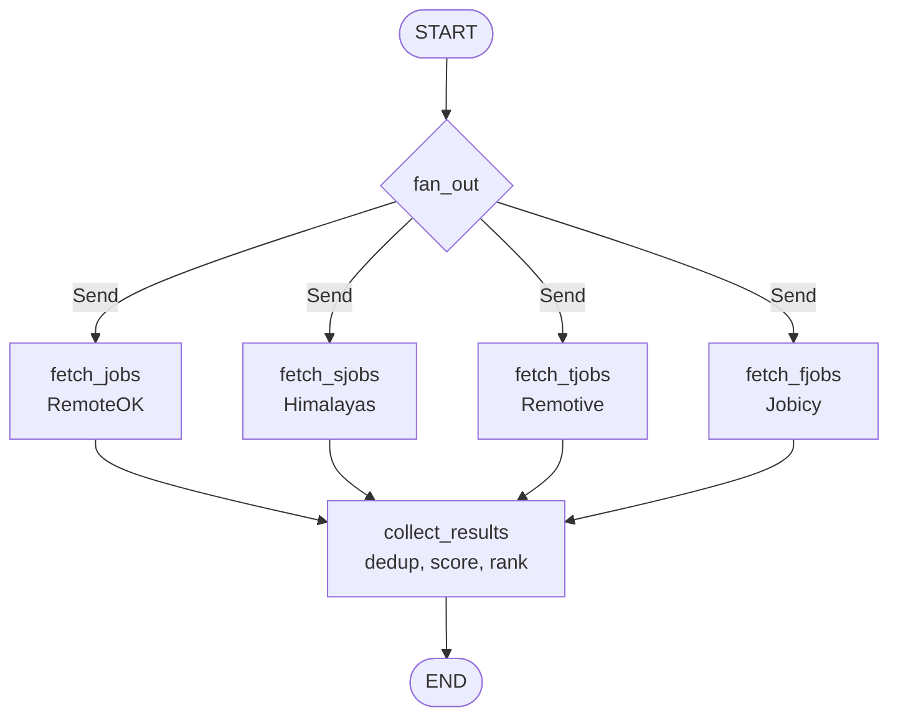

# Agent Graph

`agent.py` defines the single computational core shared by all three interfaces. It is a LangGraph `StateGraph` that fans out to four job APIs in parallel, deduplicates, scores, ranks, and caps at 12 results. No LLM is involved anywhere in this path.

## State definition

```python
class State(TypedDict):
    fetched_jobs: Annotated[list[dict], add_or_reset]
    clean_jobs: list[dict]
    last_fetch_time: str
    current_job: dict
    user_input: str = ""
    memory: Annotated[list[str], add_or_reset]
```

`add_or_reset` is the reducer: it appends new items to the existing list, or returns `[]` if `new` is `None` (used by `/reset` to clear memory). `fetched_jobs` uses this reducer because the four parallel fetchers each return a partial list that must be merged.

## Graph topology



*The fan-out graph: four parallel fetchers dispatched via LangGraph's Send API, then collected into a single ranked result set.*

### fan_out

```python
def fan_out(state: State):
    return [
        Send("fetch_jobs", state),
        Send("fetch_sjobs", state),
        Send("fetch_tjobs", state),
        Send("fetch_fjobs", state),
    ]
```

Uses LangGraph's `Send` API to dispatch four parallel node executions, each receiving the full state. The graph is registered with `graph.add_conditional_edges(START, fan_out)`.

## Fetchers

Each fetcher queries one job API, returns up to 10 raw listings, and handles errors gracefully.

### fetch_jobs (RemoteOK)

Queries `https://remoteok.com/api?tags={first_keyword}` — only the first keyword of the query is used as the tag parameter. After receiving results, it **re-checks every listing against its own title** using `title_hit`, because RemoteOK's tags are SEO filler. Returns `fetched_jobs[:10]`.

### fetch_sjobs (Himalayas)

Queries `https://himalayas.app/jobs/api/search?q={full_query}&worldwide=true&sort=recent`. Returns `data["jobs"][:10]`. Returns empty on 429.

### fetch_tjobs (Remotive)

Queries `https://remotive.com/api/remote-jobs?search={full_query}`. Returns `data["jobs"][:10]`. Returns empty on 429.

### fetch_fjobs (Jobicy)

Queries `https://jobicy.com/api/v2/remote-jobs?tag={full_query}`. Returns `data["jobs"][:10]`. Returns empty on 429.

All fetchers return `{"fetched_jobs": []}` on `RequestException` — a dead API is survivable (commit `f26bc5b`).

## Scoring

### signal_tokens

```python
def signal_tokens(query: str) -> list[str]:
    tokens = re.findall(r'\w+', query.lower())
    return [t for t in tokens if t not in GENERIC] or tokens
```

Strips generic words (`developer`, `engineer`, `remote`, `role`, `position`, `specialist`, `manager`, etc.) from the query. If the query is nothing but generic words, they are used anyway.

### title_hit

```python
def title_hit(token: str, title: str) -> bool:
    if len(token) < 4:
        return token in set(re.findall(r'\w+', title))
    return token in title
```

Short tokens (< 4 chars) must match a whole word — `ai` should not hit `said`. Longer tokens may match inside a word — `python` hits `python3`.

### score_job

```python
def score_job(job: dict, query: str) -> int:
    title = job_title(job)
    description = ...
    signal = signal_tokens(query)
    desc_words = set(re.findall(r'\w+', description))
    title_hits = sum(1 for s in signal if title_hit(s, title))
    desc_hits = sum(1 for s in signal if s in desc_words)
    return title_hits * TITLE_WEIGHT + desc_hits
```

`TITLE_WEIGHT = 10`. A single title hit (10) outweighs any number of description hits. `collect_results` keeps only jobs with `score >= TITLE_WEIGHT` — at least one title match is required for admission.

## collect_results

```python
def collect_results(state: State):
    seen = set()
    unique_jobs = []
    for job in state["fetched_jobs"]:
        key = job.get("apply_url") or job.get("url") or job.get("applicationLink")
        if key not in seen:
            seen.add(key)
            unique_jobs.append(job)
    scored = [(score_job(job, query), job) for job in unique_jobs]
    matched = [pair for pair in scored if pair[0] >= TITLE_WEIGHT]
    matched.sort(key=lambda pair: pair[0], reverse=True)
    matched = matched[:MAX_RESULTS]
    ...
    if len(correct_jobs) == 0:
        return {"clean_jobs": correct_jobs, "fetched_jobs": None}
    else:
        return {"clean_jobs": correct_jobs, "fetched_jobs": None,
                "last_fetch_time": datetime.now().isoformat()}
```

Pipeline: dedup by apply URL → score → keep title matches only → sort by score descending → cap at `MAX_RESULTS = 12`. Sets `fetched_jobs` to `None` (clears the accumulated list via `add_or_reset`). **`last_fetch_time` is only written when results exist** — an empty result set does not update the cache timestamp, so a subsequent retry will re-run the graph.

The description is stripped of HTML (`strip_html`) and truncated to 500 characters here. This is separate from `normalize_jobs`, which runs later in the interface layer and truncates to 150 characters via `clean_description`.

## filter_jobs

The [exclusion filter](../domains.md#thread-memory-avoid-keywords) is called by all three interfaces after the graph completes. It is **not** a graph node — it runs in the interface layer.

```python
def filter_jobs(jobs: list, memory: list, title_only=SENIORITY) -> list:
```

Key behavior:
- Flattens memory entries (comma-separated keyword lists) into a flat list
- For each job, checks each keyword:
  - If any word in the keyword is in `SENIORITY`, match against **title words only**
  - Otherwise, match against **title + description + location** (full text)
- A job is blocked if any keyword matches
- Jobs without a valid `apply_url` or with empty/`Unknown` position are also removed

The `SENIORITY` frozenset: `senior`, `sr`, `junior`, `jr`, `lead`, `principal`, `staff`, `mid`, `entry`, `head`, `director`, `vp`, `chief`, and Portuguese variants (`sênior`, `júnior`, `pleno`, `estágio`).

## normalize_jobs

Called by all three interfaces after the graph. Unifies source-specific field names into a canonical shape, repairs mojibake, cleans salary, and deduplicates by company+position hash. See [domain concepts](../domains.md#normalization-and-mojibake-repair).

## Constants

```python
TITLE_WEIGHT = 10
MAX_RESULTS = 12
```

Both live at the top of `agent.py`. `TITLE_WEIGHT` is the threshold for admission (title match required). `MAX_RESULTS` caps the returned list. An earlier version guaranteed a minimum of 8 results — removing it was the largest single quality improvement.

## Source references

- `agent.py` — the entire file (280 lines)
- `main.py:4` — imports `graph`, `normalize_jobs`, `filter_jobs`
- `mcp_server.py:3` — imports `graph`, `normalize_jobs`, `filter_jobs`
- `voice_agent.py:6` — imports `graph`, `normalize_jobs`, `filter_jobs`
- Commits `3fca572` (removed LLM from /ask), `dd282ff` (filter at fetch time), `f26bc5b` (survive dead API)
