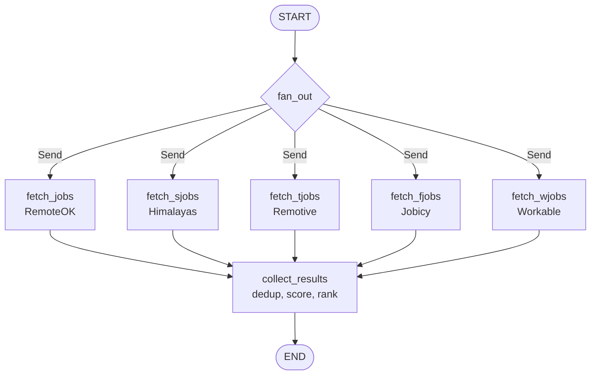

# Agent Graph

`agent.py` defines the single computational core shared by all three interfaces. It is a LangGraph `StateGraph` that fans out to five job APIs in parallel, deduplicates, scores, ranks, and caps at 12 results. No LLM is involved anywhere in this path.

## State definition

```python
class State(TypedDict):
    fetched_jobs: Annotated[list[dict], add_or_reset]
    clean_jobs: list[dict]
    last_fetch_time: str
    current_job: dict
    user_input: str = ""
    country: str = ""
    memory: Annotated[list[str], add_or_reset]
```

`add_or_reset` is the reducer: it appends new items to the existing list, or returns `[]` if `new` is `None` (used by `/reset` to clear memory). `fetched_jobs` and `memory` both use this reducer — `fetched_jobs` because the five parallel fetchers each return a partial list that must be merged, and `memory` so a reset wipes it in one step. `country` (default `""`) is the two-letter / slug country the caller asked about; it flows into the country-aware fetchers and the location filter.

## Graph topology


```mermaid
flowchart TD
    START([START]) --> fan_out{fan_out}
    fan_out -->|Send| fetch_jobs["fetch_jobs\nRemoteOK"]
    fan_out -->|Send| fetch_sjobs["fetch_sjobs\nHimalayas"]
    fan_out -->|Send| fetch_tjobs["fetch_tjobs\nRemotive"]
    fan_out -->|Send| fetch_fjobs["fetch_fjobs\nJobicy"]
    fan_out -->|Send| fetch_wjobs["fetch_wjobs\nWorkable"]
    fetch_jobs --> collect_results["collect_results\ndedup, score, rank"]
    fetch_sjobs --> collect_results
    fetch_tjobs --> collect_results
    fetch_fjobs --> collect_results
    fetch_wjobs --> collect_results
    collect_results --> END([END])
```

*The fan-out graph: five parallel fetchers dispatched via LangGraph's Send API, then collected into a single ranked result set.*

### fan_out

```python
def fan_out(state: State):
    return [
        Send("fetch_jobs", state),
        Send("fetch_sjobs", state),
        Send("fetch_tjobs", state),
        Send("fetch_fjobs", state),
        Send("fetch_wjobs", state),
    ]
```

Uses LangGraph's `Send` API to dispatch five parallel node executions, each receiving the full state. The graph is registered with `graph.add_conditional_edges(START, fan_out)`, and each fetcher node has a plain edge to `collect_results`, which has an edge to `END`.

## Tokenization and aliasing

Three small functions decide which words in the user's query are *signal* and how the rest of the pipeline matches them. They exist because the job boards spell the same role many ways — "machine learning engineer" and "ml engineer" are the same job, and without normalizing them they were two disjoint result sets (4 vs 10, none shared).

### canon and ALIASES

```python
ALIASES = {
    "large language models": "llm", "large language model": "llm",
    "natural language processing": "nlp", "artificial intelligence": "ai",
    "machine learning": "ml", "full-stack": "fullstack", "full stack": "fullstack",
    "back-end": "backend", "back end": "backend",
    "front-end": "frontend", "front end": "frontend",
    "postgresql": "postgres", "kubernetes": "k8s", "javascript": "js",
}
def canon(text: str) -> str:
    text = text.lower()
    for phrase, short in ALIASES.items():
        text = text.replace(phrase, short)
    return text
```

`canon` spells the synonyms one way *before* matching, so a single token can match every spelling. It is applied by `signal_tokens`, `distinctive_tokens`, and `job_title`.

### signal_tokens

```python
def signal_tokens(query: str) -> list[str]:
    tokens = re.findall(r'\w+', canon(query).lower())
    return [t for t in tokens if t not in GENERIC] or tokens
```

The words of the query that carry meaning, after `canon` normalization. `GENERIC` (`developer`, `engineer`, `remote`, `role`, `position`, `specialist`, `manager`, …) is stripped. If the query is nothing but generic words, they are used anyway, so "developer job" still matches.

### distinctive_tokens

```python
TAG_LIMIT = 3
def distinctive_tokens(query: str) -> list[str]:
    seen = []
    for token in re.findall(r'\w+', canon(query)):
        if token not in GENERIC and token not in seen:
            seen.append(token)
    return seen[:TAG_LIMIT]
```

Picks the non-generic tokens in order, deduplicated, capped at `TAG_LIMIT = 3`. These are the tag-based API queries (RemoteOK, Jobicy). Picking the wrong word costs almost every result (`?tags=fullstack` returns 1 listing where `?tags=react` returns 101), so the fetchers try these in order and stop as soon as one comes back full. Empty means no word narrows anything, and the caller should ask without a tag. `fetch_wjobs` falls back to `signal[:1]` when `distinctive_tokens` is empty.

### title_hit

```python
def title_hit(token: str, title: str) -> bool:
    return re.search(rf'\b{re.escape(token)}(?:js|s|\d+)?\b', title) is not None
```

A token matches a whole word, optionally with a plural, version, or `js` suffix. There is no longer a `< 4` char special case: the same word-boundary rule applies to every token. Substring matching was the earlier rule for longer tokens, which let "rust" fire on "anti-trust" and would let "java" fire on "javascript". Only prefixes were ever the problem, so suffixes stay allowed: "python" hits "python3", "react" hits "reactjs", "agent" hits "agents".

## Fetchers

Each fetcher queries one job API and handles errors gracefully — a dead or rate-limited API is survivable (every fetcher returns `{"fetched_jobs": []}` on `RequestException`).

### fetch_jobs (RemoteOK)

```python
ENOUGH = 50
```

Uses `distinctive_tokens` (not just the first keyword) and tries the tags in order. For each tag it calls `https://remoteok.com/api?tags={tag}`, and breaks as soon as a page returns `>= ENOUGH` (50) results. Results are deduplicated by URL/id via `raw.setdefault(...)` across tag attempts. Finally it **re-checks every listing against its own title** with `title_hit`, because RemoteOK's tags are SEO filler — so a listing must match the query in its title to survive. Returns the full filtered list (not capped at 10).

### fetch_sjobs (Himalayas)

Queries `https://himalayas.app/jobs/api/search?q={full_query}&worldwide=true&sort=recent`. Returns `data["jobs"]`. Returns empty on 429.

### fetch_tjobs (Remotive)

```python
_REMOTIVE = {"at": 0.0, "jobs": []}
REMOTIVE_TTL = 6 * 3600
```

Remotive is a **cached feed, not a search**. `remotive_feed()` holds a module-level `_REMOTIVE` dict refreshed at most every `REMOTIVE_TTL` (6 hours). The edge cache in front of the Remotive API does not vary on the query string — two unrelated searches return the same titles in the same order, every response carrying `Cf-Cache-Status: HIT` — so there is one feed held between calls. A failed refresh (non-200 or `RequestException`) keeps the previous list rather than emptying it. `fetch_tjobs` then filters that feed by `title_hit` against `signal_tokens(query)`, so only titles matching the query are returned.

### fetch_fjobs (Jobicy)

Uses `distinctive_tokens` and a `geo={country}` parameter. For each tag it builds `https://jobicy.com/api/v2/remote-jobs?tag={tag}&geo={country}`. A country Jobicy does not know returns HTTP 400 (not an empty answer), so on 400 the fetcher retries the same URL without `geo` and lets `location_ok` do the filtering. Results are deduplicated by URL/id across tag attempts, and if a page returns `>= ENOUGH` (50) the loop breaks. If every tagged attempt came back empty (`len(raw) == 0`), it falls back to an untagged request and merges those jobs in. Returns the merged list.

### fetch_wjobs (Workable)

The only two-round fetcher. Workable is the ATS most companies here run, so a role in a specific country appears on its public board and almost nowhere else.

1. **`workable_urls(token, country)`** — the search page. The page renders client-side but also carries a schema.org `ItemList` in `<script type="application/ld+json">`, which is plain JSON and enough to extract the links. The URL is the **path form** `https://jobs.workable.com/search/{country}/remote-{token}-jobs` because `robots.txt` allows `/search/*` and disallows the query-string form. The country segment is **mandatory** — drop it and the board stops reading the keyword, answering `remote-python-jobs` with commercial representatives in Rome; `worldwide` is the slug that means no country. A country Workable does not recognise answers 200 with an **empty list** rather than an error, so an empty result with a country is retried worldwide.
2. **`workable_job(url)`** — each surviving posting's page. Parses the schema.org `JobPosting` LD+JSON block and extracts title, company (`hiringOrganization.name`), location (`applicantLocationRequirements.name`), description, `publication_date`, and the URL.

`fetch_wjobs` collects links across `distinctive_tokens(state["user_input"])` (falling back to `signal[:1]`), deduplicating by `workable_key` (title + employer, since a role open in six cities is posted six times) and pre-filtering by `title_hit` on the title encoded in the link slug (`workable_title`) — so the per-posting requests only open postings that already matched. `WORKABLE_DETAILS = 6` caps the number of per-posting fetches.

### fetch_fijobs (Arbeitsnow) — disabled

A `fetch_fijobs` for the arbeitnow.com feed is defined but commented out and not registered in the graph.

## Scoring

### score_job

```python
def score_job(job: dict, query: str) -> float:
    title = job_title(job)
    description = (job.get("description") or ... ).lower()
    signal = signal_tokens(query)
    words = re.findall(r'\w+', canon(query).lower())
    gen = [w for w in words if w in GENERIC]
    gen_hits = 0 if len(words) == len(gen) else sum(1 for g in gen if title_hit(g, title))
    desc_words = re.findall(r'\w+', description)
    freq = sum(desc_words.count(s) for s in signal)
    bonus = freq / 8
    title_hits = sum(1 for s in signal if title_hit(s, title))
    desc_hits = sum(1 for s in signal if s in desc_words)
    hits = min(desc_hits + gen_hits + bonus, 9) + title_hits * TITLE_WEIGHT
    return hits
```

The score is no longer just `title_hits * 10 + desc_hits`. It combines four signals:

- **`title_hits`** — how many `signal_tokens` match the title via `title_hit`, weighted by `TITLE_WEIGHT = 10`.
- **`desc_hits`** — how many signal words appear in the description at all.
- **`gen_hits`** — a generic-word tie-breaker: if the query had non-generic words, how many of its `GENERIC` words appear in the *title*. When the whole query is generic, `gen_hits` is forced to 0 so a query of pure generic words does not inflate scores.
- **`bonus = freq / 8`** — frequency-based description scoring: the total count of signal-word occurrences in the description divided by 8, rewarding descriptions that mention the query terms repeatedly.

The description contribution (`desc_hits + gen_hits + bonus`) is **capped at 9**, which is below `TITLE_WEIGHT = 10`. This is the invariant: a description match can only *reorder* results within the admitted set, never admit a job the title did not match. `collect_results` keeps only `score >= TITLE_WEIGHT`, so admission still means "at least one title hit."

## collect_results

```python
def collect_results(state: State):
    seen = set()
    unique_jobs = []
    query = state.get("user_input")
    country = state.get("country", "")
    for job in state["fetched_jobs"]:
        key = re.sub(r'[^a-z0-9]', '', f"{job_company(job).lower()}{job_title(job)}")
        if key not in seen and location_ok(job, country) and job_is_recent(job):
            seen.add(key)
            unique_jobs.append(job)
    scored = [(score_job(job, query), job) for job in unique_jobs]
    matched = [pair for pair in scored if pair[0] >= TITLE_WEIGHT]
    matched.sort(key=lambda pair: pair[0], reverse=True)
    ...
    matched = matched[:MAX_RESULTS]
    ...
```

The dedup key is now the **company + title hash** (`re.sub(r'[^a-z0-9]', '', company.lower() + title)`), not the apply URL. The same role is often posted once per city — six identical "Senior Backend Engineer" listings with six different links — so identity is employer and title, or duplicates take places in the twelve and the reader is handed seven.

Each surviving job must also pass two filters before scoring:

- **`location_ok(job, country)`** — the single place for the country, whether the source filtered on its own or not. Empty `country` means no filtering. Otherwise a listing is open if it names the country, names a region containing it (via `REGIONS`), says it is worldwide (`GLOBAL_WORDS`), or says nothing about location (most boards, when the answer is "anywhere").
- **`job_is_recent(job)`** — `MAX_AGE_DAYS = 120`. Workable in particular keeps filled roles on its board; a listing older than 120 days is dropped. Sources spell the date as an ISO string or epoch seconds; a listing with no date is kept (absence is not age), and an unparseable date is kept too (the `try/except` returns `True`).

Then: score → keep `score >= TITLE_WEIGHT` → sort by score descending → cap at `MAX_RESULTS = 12`. The description is `strip_html`-cleaned and truncated to 500 characters here, separate from `normalize_jobs` (150, in the interface layer).

`fetched_jobs` is set to `None` (clears the accumulated list via `add_or_reset`). **`last_fetch_time` is only written when results exist** — an empty result set does not update the cache timestamp, so a subsequent retry re-runs the graph.

## filter_jobs

The [exclusion filter](../domains.md#thread-memory-avoid-keywords) is called by all three interfaces after the graph completes. It is **not** a graph node — it runs in the interface layer.

```python
def filter_jobs(jobs: list, memory: list, title_only=SENIORITY) -> list:
```

Key behavior:

- Flattens memory entries (comma-separated keyword lists) into a flat list of keywords.
- For each job, checks each keyword: if any word in the keyword is in `SENIORITY`, match against **title words only**; otherwise match against **title + description + location** (full text). A job is blocked if any keyword matches.
- Also removes jobs without a valid `apply_url` or with empty / `Unknown` position.

The `SENIORITY` frozenset now includes more terms: `senior`, `sr`, `junior`, `júnior`, `jr`, `lead`, `principal`, `staff`, `mid`, `entry`, `pleno`, `sênior`, `estágio`, `head`, `director`, `vp`, `chief`.

## normalize_jobs

Called by all three interfaces after the graph. Unifies source-specific field names into a canonical shape (`company`, `position`, `location`, `description`, `salary`, `apply_url`), repairs mojibake via `fix_mojibake` (on company, position, location, and description), strips HTML from the description via `strip_html`, cleans salary, and deduplicates by a **company + position hash** (`re.sub(r'[^a-z0-9]', '', company.lower() + position.lower())`). See [domain concepts](../domains.md#normalization-and-mojibake-repair).

## Constants

```python
TITLE_WEIGHT = 10
MAX_RESULTS = 12
MAX_AGE_DAYS = 120
TAG_LIMIT = 3
ENOUGH = 50
REMOTIVE_TTL = 6 * 3600
WORKABLE_DETAILS = 6
```

All live at the top of `agent.py`. `TITLE_WEIGHT` is the admission threshold (title match required); `MAX_RESULTS` caps the returned list; `MAX_AGE_DAYS` is the freshness cutoff; `TAG_LIMIT` caps `distinctive_tokens`; `ENOUGH` is the "stop trying more tags" threshold; `REMOTIVE_TTL` is the Remotive cache lifetime; `WORKABLE_DETAILS` caps per-posting Workable fetches.

## Source references

- `agent.py` — the entire file (~596 lines)
- `main.py` — imports `graph`, `normalize_jobs`, `filter_jobs`
- `mcp_server.py` — imports `graph`, `normalize_jobs`, `filter_jobs`
- `voice_agent.py` — imports `graph`, `normalize_jobs`, `filter_jobs`
- Commits `3fca572` (removed LLM from /ask), `dd282ff` (filter at fetch time), `f26bc5b` (survive dead API)
