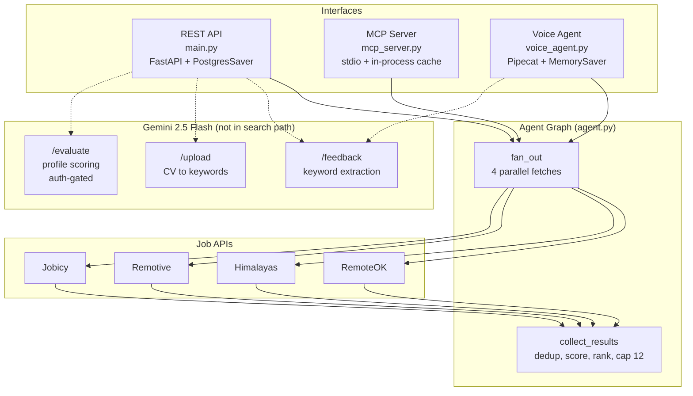
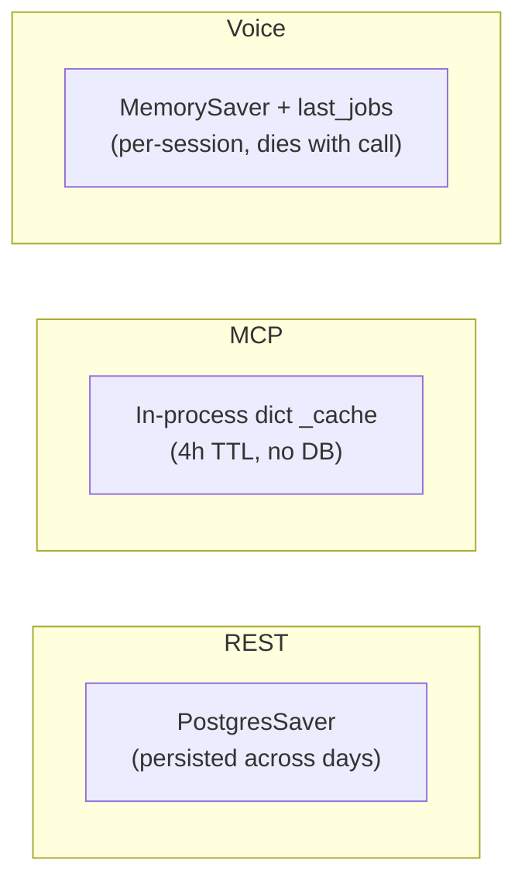

# Architecture Overview

The job search agent has a single computational core — the LangGraph graph in `agent.py` — exposed through three interfaces, each with its own persistence and caching strategy.

## System topology

*Three interfaces over one graph. The graph is deterministic. The LLM is used only by the dashed paths — feedback extraction, CV parsing, and the auth-gated evaluator.*

## The LLM boundary

The search path is **LLLM-free**. Scoring is pure keyword arithmetic: `title_hits * 10 + description_hits`. The graph fans out, collects, scores, ranks, and returns — no model involved.

Three operations still use Gemini 2.5 Flash:

| Operation | Endpoint/Path | Input bound | Why LLM |
|---|---|---|---|
| Feedback keyword extraction | `POST /feedback` (REST), `VoiceSession.resume()` (voice) | 100 chars (REST) | Turns "no MERN" into `["full stack", "MERN", "MEAN", "frontend"]` |
| CV parsing | `POST /upload` | 5MB, first 5 pages, PDF only | Compresses CV into a 20-word keyword search query |
| Job evaluation | `POST /evaluate` | Arbitrary text | Scores listings against a hardcoded profile |

`/evaluate` is the only endpoint with authentication: `x-api-key` header matched against `EVALUATE_TOKEN` via `secrets.compare_digest`. It accepts arbitrary text (the job listings) and is therefore closed to prevent a free LLM call (commit `4f0c4a9`). `/feedback` and `/upload` stay open but are bounded by input size.

The history matters: the agent originally passed every fetched listing through Gemini to decide relevance. That worked but hid a bug — irrelevant results were never filtered at fetch time; the model just declined to print them. Commit `3fca572` removed the LLM from `/ask`, and `dd282ff` moved filtering to fetch time. The deterministic path fixed the bug, removed the cost, and made results reproducible.

## Memory models

Each interface uses a different persistence strategy for the same filtering logic:

*Three persistence models for the same filter_jobs logic.*

| Interface | Checkpointer | Cache TTL | Exclusion source |
|---|---|---|---|
| REST (`main.py`) | `PostgresSaver` | 4h (14400s) on `last_fetch_time` | Accumulated in Postgres via `agent.update_state` |
| MCP (`mcp_server.py`) | None | 4h (14400s) on `_cache` dict | Explicit `exclude_keywords` argument per call |
| Voice (`voice_agent.py`) | `MemorySaver` | Per-session | `VoiceSession.memory` list (in-memory) |

The 14400s threshold is the same freshness policy on two backings. In REST, it lives in Postgres checkpointer state as `last_fetch_time`; in MCP, it lives in an in-process dict as `CACHE_TTL`. Both avoid re-hitting job boards for the same query within 4 hours.

REST's memory accumulates across days — a user who says "no senior" on Monday still has that filter on Wednesday. MCP takes exclusions as an explicit argument every call — the client's conversation is the memory. Voice keeps preferences only for the duration of a call.

## Data flow summary

1. **Input**: user query (REST/MCP) or spoken text (voice)
2. **Cache check**: if the same query was searched < 4h ago, return cached results (REST/MCP)
3. **Graph fan-out**: `Send` API dispatches 4 parallel fetchers (RemoteOK, Himalayas, Remotive, Jobicy)
4. **Collect**: `collect_results` deduplicates by `apply_url`, scores each job, keeps only title matches (`>= TITLE_WEIGHT`), sorts by score, caps at `MAX_RESULTS = 12`
5. **Normalize**: `normalize_jobs` unifies fields, repairs mojibake, cleans salary, deduplicates by company+position hash
6. **Filter**: `filter_jobs` removes jobs matching accumulated exclusions (seniority terms against title only, others against full text)
7. **Output**: markdown text (REST) or structured JSON list (MCP) or spoken summary + terminal print (voice)

## Related pages

- [Agent graph](agent-graph.md) — the graph internals, scoring, filtering, normalization
- [Backend API](backend-api.md) — the REST endpoints in detail
- [MCP server](../mcp-server.md) — the stdio tool
- [Voice agent](../voice-agent.md) — the Pipecat interface
- [Domain concepts](../domains.md) — scoring rules and filter semantics
