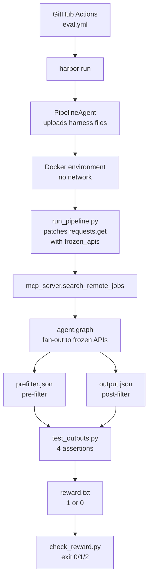

# Harbor Eval

The Harbor eval is a deterministic regression test for the agent's `filter_jobs` exclusion logic. It exists because the [LangSmith eval](langsmith-eval.md) runs against live job boards that shift hourly — a code change cannot be isolated from market drift. Harbor freezes the data and asserts an exact output set.

## What it tests

One capability: applying a user exclusion to a fixed result set. Drop every listing whose **title** carries the excluded seniority term; keep every other listing. Over-inclusion (a senior job survives) and over-filtering (a valid job is dropped) are both failures.

The test query is `python developer` with exclusions `["senior", "game", "canonical"]`. Three exclusions chosen to exercise both branches of `filter_jobs`:

| Term | What it drops | `filter_jobs` branch |
|---|---|---|
| `senior` | "Senior Software Engineer - Python/MongoDB" | Title only (seniority match) |
| `game` | Two Panda3D game developer listings | Full text (title + description + location) |
| `canonical` | Two listings where the word appears only in the description | Full text |

Result: 5 listings kept, 5 dropped.

## Architecture



*Harbor runs the repository's own MCP pipeline against frozen fixtures, then verifies the output with deterministic assertions. No LLM, no network inside the container.*

## The two-artifact evidence model

`run_pipeline.py` produces two JSON files:

1. **`prefilter.json`** — the pipeline output *before* `filter_jobs` runs (what the filter was given). Pulled from `mcp_server._cache` after `search_remote_jobs` populates it.
2. **`output.json`** — the pipeline output *after* `filter_jobs` runs (what the filter returned).

This two-artifact model is central to why the eval is trustworthy. The verifier checks both: it asserts the prefilter set equals `keep ∪ drop` (the environment didn't drift) and that the output set equals `keep` (the filter worked correctly).

## Environment: frozen APIs

`environment/frozen_apis.py` replaces `requests.get` with a host router:

```python
HOSTS = {
    "remoteok.com": "remoteok.json",
    "himalayas.app": "himalayas.json",
    "remotive.com": "remotive.json",
    "jobicy.com": "jobicy.json",
}

def frozen_get(url, *args, **kwargs):
    host = urlparse(url).hostname or ""
    if host not in HOSTS:
        raise RuntimeError(f"unfrozen host: {host}")
    payload = json.loads((FIXTURES / HOSTS[host]).read_text(encoding="utf-8"))
    return FrozenResponse(payload)
```

All other `requests` methods (`post`, `put`, `patch`, `delete`, `head`, `options`, `request`) and `Session.request` are replaced with functions that raise — a call that escaped the stub would fail in-process even on a networked host. The `FrozenResponse` stub exposes only `.json()` and `.status_code = 200` — the two attributes the fetchers touch. The query string is ignored (one task, one query, stated in `instruction.md`).

Fixtures are the verbatim `response.json()` of each API, captured 04/08/2026 for query `python developer`. They live in `environment/fixtures/`.

## Network enforcement

Two independent layers:

1. **Docker Compose overlay** (`evals/configs/no-network.yaml`): `network_mode: none` on the `main` service. Verified by a DNS resolution failure in the first run's verifier log.
2. **`frozen_apis.py`**: replaces every `requests` entry point other than the frozen `get` with a function that raises.

`task.toml` declares `network_mode = "public"` because Harbor's own `no-network` policy is not available on Windows hosts (WSL2 kernel lacks `CONFIG_NFT_FIB_INET`). The overlay is the enforcement, not the declaration.

## The adapter: PipelineAgent

`evals/harbor_agents/pipeline_agent.py` implements `harbor.agents.base.BaseAgent`:

1. Uploads `instruction.md` to the container
2. Uploads `agent.py` and `mcp_server.py` **unmodified** from the repo root
3. Uploads `run_pipeline.py`
4. Executes `python /app/run_pipeline.py` in the container
5. Records stdout/stderr/return_code

No model is involved. The adapter contains no answer, no expected set, and no filtering logic — it just runs the pipeline and records what it produced.

## The harness: run_pipeline.py

Runs inside the container:

```python
sys.path.insert(0, "/app/frozen")
sys.path.insert(0, "/app")
import frozen_apis  # patches requests.get before agent loads
import mcp_server
from mcp_server import search_remote_jobs

block = re.search(r"```json\s*(\{.*?\})\s*```", instruction_text, re.DOTALL)
request = json.loads(block.group(1))
output = search_remote_jobs(request["query"], request["exclude"])
prefilter = mcp_server._cache[query.strip().lower()][1]
# dump both to /app and /logs/agent
```

Imports `frozen_apis` first so `requests.get` is patched before `agent.py` loads. Parses the JSON request from the instruction markdown. Calls `search_remote_jobs` (the production MCP tool). Extracts the prefilter from the MCP cache.

## The verifier: test_outputs.py

Four pytest assertions (reward 1 if all pass, else 0):

| Test | What it checks |
|---|---|
| `test_the_filter_saw_the_frozen_listings` | `urls(prefilter) == set(expected["keep"]) \| set(expected["drop"])` — environment guard |
| `test_no_seniority_match_in_a_title_survived` | No surviving listing has "senior" in its `position` |
| `test_no_free_keyword_match_survived` | No surviving listing has "game" or "canonical" in its text |
| `test_nothing_valid_was_dropped` | `set(expected["keep"]) - urls(output)` is empty |
| `test_exact_result_set` | `urls(output) == set(expected["keep"])` |

The environment guard is critical: if the fixtures or fan-out changed, every other assertion is measuring something else. A verifier that recomputed the answer with `filter_jobs` would grade the code against itself and always pass. `expected.json` is **hand-written** from `prefilter.json`.

`test.sh` runs pytest with `--ctrf` output and writes `1` to `/logs/verifier/reward.txt` if pytest passes, `0` if it fails. The reward file is what Harbor reads as the trial outcome.

## The build verdict: check_reward.py

Harbor exits 0 whether the code passed or failed — the reward lives in `result.json`. `check_reward.py` separates three outcomes:

| Exit code | Meaning | Reaction |
|---|---|---|
| 0 | All trials passed | Green build |
| 1 | Eval failed (reward != 1.0) | Red build — the filter changed behavior |
| 2 | Infrastructure error | The harness never ran — says nothing about the code |

Infrastructure error (exit 2) is triggered when: `result.json` does not exist, OR `n_errored_trials + n_cancelled_trials > 0`, OR trials are incomplete (`n_total - n_completed > 0`).

Eval failure (exit 1) is detected by iterating `stats["evals"][*]["reward_stats"]["reward"]` — any reward value other than `1.0` is a failure. For each failed trial, it prints the FAILED line and the first 20 lines starting with `FAILED` or `E ` from the trial's `test-stdout.txt`.

## CI integration

`.github/workflows/eval.yml` runs the Harbor eval on:
- Push to `main` (paths: `agent.py`, `mcp_server.py`, `evals/**`, the workflow itself)
- Pull requests (same paths)
- Manual dispatch

```yaml
harbor run \
  -p evals \
  -i "*filter-exclusion-senior*" \
  -a evals.harbor_agents.pipeline_agent:PipelineAgent \
  -e docker \
  -o evals/jobs \
  --extra-docker-compose evals/configs/no-network.yaml \
  --job-name ci-${{ github.run_id }} -y
```

Then `python evals/check_reward.py evals/jobs/ci-${{ github.run_id }}` checks the result and the workflow uploads run evidence as an artifact (14-day retention).

## Negative control

Removing `"senior"` from `agent.SENIORITY` is **not** a valid control: the term would simply be matched as an ordinary keyword and drop the same listing by its title, leaving the reward at 1. The actual negative control used is collapsing the branch selection in `filter_jobs` so every keyword is matched against the title only — this would let `canonical` (which appears only in descriptions) through, correctly failing the eval.

## Fidelity limits

- One query only (`python developer`) — nothing here says anything about other vocabulary
- Frozen at a point in time — these listings will not exist in a month (that is the point)
- No listing in the frozen set carries "senior" in its description only, so the title-only rule is never tested in the one shape that distinguishes it from plain full-text matching
- `agent.py` and `mcp_server.py` are copied into the image unmodified — a change to either invalidates prior run evidence (digests in `evals/specs/filter-exclusion-senior/harness-digest.txt`)

## Source references

- `evals/filter-exclusion-senior/` — the task
- `evals/harbor_agents/pipeline_agent.py` — the adapter
- `evals/harbor_agents/run_pipeline.py` — the harness
- `evals/check_reward.py` — the build verdict
- `evals/specs/filter-exclusion-senior/` — design documents
- `.github/workflows/eval.yml` — CI
- Commits `df2b58a` (CI), `bc47271` (measure against frozen listings), `d09077f` (LF scripts)
