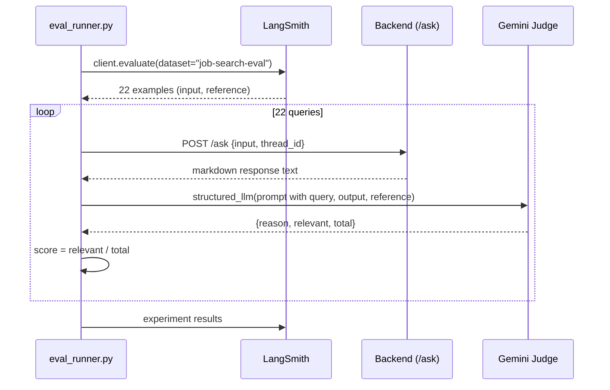

# LangSmith Eval

`eval_runner.py` is a LangSmith-backed regression harness that measures end-to-end search quality. Unlike the [Harbor eval](harbor-eval.md), it runs against live job boards, so individual cases wobble between runs — the aggregate is the signal.

## How it works



*The eval runner posts each query to /ask, then a Gemini judge counts how many returned listings match the reference criteria.*

## Implementation

```python
client = Client()

def run_agent(inputs: dict) -> dict:
    response = requests.post("http://localhost:8002/ask", json={
        "user_input": inputs["input"],
        "thread_id": f"eval-{uuid.uuid4()}"
    }, timeout=180)
    response.raise_for_status()
    return {"output": response.text}

def correctness(run, example) -> dict:
    query = example.inputs["input"]
    results = run.outputs["output"]
    reference = example.outputs["referenceOutput"]
    prompt = f"""You are evaluating a job search agent output..."""
    response = structured_llm.invoke(prompt)
    score = response.relevant / response.total
    return {"key": "correctness", "score": score, "comment": response.reason}

client.evaluate(run_agent, data="job-search-eval",
                evaluators=[correctness],
                experiment_prefix="correctness-test")
```

Each example in the LangSmith dataset `job-search-eval` carries:
- `input`: the query string (e.g., "rust", "blockchain solidity", "remote job", "COBOL mainframe developer")
- `referenceOutput`: a written description of what a good answer looks like

The judge uses `structured_llm` (`llm.with_structured_output(Output)`) to return `{reason: str, relevant: int, total: int}`. The `total` field has `Field(ge=1)` — it must be at least 1. Score is `relevant / total` — padding a response with weak matches lowers the score.

The zero-jobs rule: if the agent returns no jobs, `total` is set to 1 and `relevant` is 1 if the reference answer aligns with returning nothing, else 0. A `ValidationError` on the structured output falls back to returning a comment only (no score).

Each run gets a fresh UUID-based `thread_id` (e.g., `eval-uuid`), so memory is not carried between test cases.

## Running

```bash
python eval_runner.py   # posts to localhost:8002/ask
```

The backend must be running on port 8002 (commit `6ef4e7c`). The runner uses a 180-second timeout per query. Requires `LANGSMITH_API_KEY` and `GEMINI_API_KEY` in the environment.

## Current baseline: 0.812

Roughly four in five returned listings are relevant. Twelve of the 22 cases score a clean 1.0.

### The dataset

The 22 queries include:
- Narrow niches: `rust`, `blockchain solidity`
- Vague queries: `remote job`
- A query whose right answer is probably nothing: `COBOL mainframe developer`
- Intentional misspellings: `pyton developer` — typos are not corrected on purpose; the reference answer says returning nothing is correct

### How the score moved

All steps measured against the same 22 cases; most gains came from removing rules:

| Change | Score |
|---|---|
| Starting point | 0.558 |
| Stopped trusting RemoteOK's tags, matched on titles | 0.575 |
| Removed the guaranteed minimum of 8 results | 0.679 |
| Treated `developer` and `engineer` as meaningful words | 0.584, reverted |
| Fixed reference answers for typo queries | 0.751 |
| Fixed a missing comma in the generic-word list | 0.812 |

The largest jump came from deleting the minimum-results rule. On a query like `rust`, the agent would find one genuine match and pad with seven listings that merely mentioned "rust" somewhere in their body text.

The missing-comma bug: two adjacent string literals in a Python set silently became one, dropping `engineer` and `remote` from the generic-word list. Python never complained.

### What the number does not cover

- **First response only** — none of the 22 cases exercise conversational filtering (`no support roles`, `no senior`). Real usage is better than 0.812 suggests.
- **Live data** — individual cases wobble between runs; the aggregate is the signal.
- **Known limitation** — one title match is enough to admit a listing, so `data` pulls in Data Analysts. Requiring two matching words was tried and rejected because specific terms like `sql`, `aws`, and `pytorch` appear in ~0% of returned job titles.

### Why Harbor was built next to it

The LangSmith eval runs against live data, so a change cannot be isolated from the market shifting underneath it. The [Harbor eval](harbor-eval.md) was built for the opposite: fixed listings, deterministic verification, no LLM judge. The hard cases are planned to be rebuilt as Harbor tasks with LangChain's eval-engineering skill, where listings are fixed and verification is deterministic.

## Source references

- `eval_runner.py` — the entire file (71 lines)
- `main.py` — the `/ask` endpoint being tested
- `agent.py` — the search logic being measured
- Commits `60d33bc` (0.812 baseline), `f002cf5` (ratio scoring), `6ef4e7c` (port fix)
