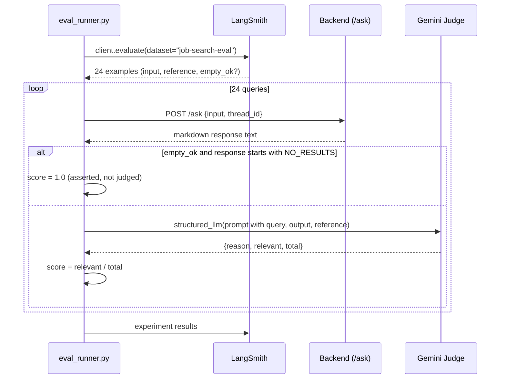

# LangSmith Eval

`eval_runner.py` is a LangSmith-backed regression harness that measures end-to-end search quality. Unlike the [Harbor eval](harbor-eval.md), it runs against live job boards, so individual cases wobble between runs — the aggregate is the signal.

## How it works


```mermaid
sequenceDiagram
    participant E as eval_runner.py
    participant LS as LangSmith
    participant B as Backend (/ask)
    participant J as Gemini Judge

    E->>LS: client.evaluate(dataset="job-search-eval")
    LS-->>E: 24 examples (input, reference, empty_ok?)
    loop 24 queries
        E->>B: POST /ask {input, thread_id}
        B-->>E: markdown response text
        alt empty_ok and response starts with NO_RESULTS
            E->>E: score = 1.0 (asserted, not judged)
        else
            E->>J: structured_llm(prompt with query, output, reference)
            J-->>E: {reason, relevant, total}
            E->>E: score = relevant / total
        end
    end
    E->>LS: experiment results
```

*The eval runner posts each query to /ask, then either asserts an empty response (when `empty_ok` is set) or asks a Gemini judge to count how many returned listings match the reference criteria.*

## Implementation

```python
client = Client()

def run_agent(inputs: dict) -> dict:
    response = requests.post("http://localhost:8002/ask", json={
        "user_input": inputs["input"],
        "thread_id": f"eval-{uuid.uuid4()}"
    }, timeout=180)
    response.raise_for_status()
    return {"output": response.text}

def correctness(run, example) -> dict:
    query = example.inputs["input"]
    results = run.outputs["output"]
    reference = example.outputs["referenceOutput"]
    if example.outputs.get("empty_ok") and results.startswith(NO_RESULTS):
        return {"key": "correctness", "score": 1.0,
                "comment": "Returned nothing, and the reference accepts nothing. Asserted, not judged."}
    prompt = f"""You are grading one response from a job search agent ..."""
    response = structured_llm.invoke(prompt)
    score = response.relevant / response.total
    return {"key": "correctness", "score": score, "comment": response.reason}

client.evaluate(run_agent, data="job-search-eval",
                evaluators=[correctness],
                experiment_prefix="correctness-test")
```

Each example in the LangSmith dataset `job-search-eval` carries:
- `input`: the query string (e.g., "rust", "blockchain solidity", "remote job", "COBOL mainframe developer")
- `referenceOutput`: a written description of what a good answer looks like
- `empty_ok` (optional): a flag marking queries where returning nothing is the correct answer

The judge uses `structured_llm` (`llm.with_structured_output(Output)`) to return `{reason: str, relevant: int, total: int}`. The `total` field has `Field(ge=1)` — it must be at least 1. Score is `relevant / total` — padding a response with weak matches lowers the score.

The `empty_ok` flag short-circuits to 1.0 before the judge is called: if `example.outputs.get("empty_ok")` is set and the response starts with `NO_RESULTS` (imported from `main.py`), the score is asserted at 1.0 with the comment "Returned nothing, and the reference accepts nothing. Asserted, not judged." This covers the ~five queries whose correct answer is nothing — deliberate misspellings and niches the boards may not be advertising. A rule you can state in one sentence does not need a model. A `ValidationError` on the structured output falls back to returning a comment only (no score).

Each run gets a fresh UUID-based `thread_id` (e.g., `eval-{uuid}`), so memory is not carried between test cases.

## Running

```bash
python eval_runner.py   # posts to localhost:8002/ask — change the port if your backend runs elsewhere
```

The runner uses a 180-second timeout per query. Requires `LANGSMITH_API_KEY` and `GEMINI_API_KEY` in the environment.

## Current baseline: ~0.90 (24 cases, measured 16 August)

Roughly nine in ten returned listings are relevant across 24 cases. Previous baselines (0.82, 0.812) are **not comparable** — the dataset and the judge both changed. Treat the number as a range, not a reading.

### Control-run methodology

The agent queries live job boards, so two runs an hour apart see different listings and individual cases wobble by a lot. The same code scored **0.765** five days after scoring **0.82** without a line changing — the job boards had moved. A single case can swing half a point on its own: `rust` went from 1.0 to 0.5 across those five days, and the query has no moving parts in the code at all.

So changes here are judged against a **control run of the unchanged code on the same day**, never against a number from last week. Comparing a new run to a stored baseline measures the market as much as the change, and the market is louder.

### The dataset

The 24 queries include:
- Narrow niches: `rust`, `blockchain solidity`
- Vague queries: `remote job`
- A query whose right answer is probably nothing: `COBOL mainframe developer`
- Intentional misspellings: `pyton developer` — typos are not corrected on purpose; the reference answer says returning nothing is correct
- Two real queries from the live demo: `Remote React jobs` and `Fullstack react remote jobs`, added after logs showed both returning almost nothing. Both now score 1.0 — which is its own finding: the metric is precision, so two correct listings score perfectly while the person who typed the query went away and tried again.

### How the score moved

The first table is measured against the same 22 cases; most gains came from removing rules:

| Change | Score |
|---|---|
| Starting point | 0.558 |
| Stopped trusting RemoteOK's tags, matched on titles | 0.575 |
| Removed the guaranteed minimum of 8 results | 0.679 |
| Treated `developer` and `engineer` as meaningful words | 0.584, reverted |
| Fixed the reference answers for the typo queries | 0.751 |
| Fixed a missing comma in the generic-word list | 0.812 |

Five days later the same code scored 0.765, so everything after that point is quoted against a control run of the unchanged code on the same morning:

| Change | Control | Score |
|---|---|---|
| Let the query's generic word break ties in the title | 0.765 | 0.780 |
| Scored descriptions on how often a word appears, and stopped truncating each source to ten | 0.76 | **0.82** |

The largest jump came from deleting the minimum-results rule. On a query like `rust`, the agent would find one genuine match and pad with seven listings that merely mentioned "rust" somewhere in their body text. Three good results beat twelve mediocre ones.

The missing-comma bug: two adjacent string literals in a Python set silently became one, dropping `engineer` and `remote` from the generic-word list. Python never complained — it only surfaced because a nonsense query started returning listings with "Remote" in the title.

### Making the judge repeatable

Scoring the same listings twice and getting 0.889 and 0.222 makes every comparison meaningless, so the run was treated as the thing under test rather than the agent. Three changes, in order of how much they bought:

**Short-circuit the empty cases.** ~Five queries are ones where returning nothing is acceptable. Those examples now carry the `empty_ok` flag, and an empty response short-circuits to 1.0 before the judge is called. Four of the five already said so in their reference text; the model had the instruction and applied it unevenly.

**Say what the grader is grading.** The original prompt asked the judge to "count how many of the given jobs match the reference criteria" without ever saying whether a bad listing costs one point or voids the response. Both readings were live, which is exactly the 0.889/0.222 split. The prompt now states: grade only what was returned; a rejected listing subtracts one and nothing more; criteria silent about a listing count in its favour; never lower the score because an expected listing is missing.

**Write criteria that can be decided.** `Python developer` said "mid-level or senior, no Junior or Entry-level" and left "Senior General QA (Python)" undecidable. Ten of the original twenty-two reference answers were rewritten as "a listing is relevant when… and is not relevant when…", resolved against the listings the agent actually returns.

### What the number does not cover

- **First response only** — none of the cases exercise conversational filtering (`no support roles`, `no senior`). Real usage is better than the number suggests.
- **Live data** — individual cases wobble between runs; the aggregate is the signal.
- **Precision, not recall** — the two real demo queries score 1.0 with only a few correct listings. The metric cannot see that a user went away with too little.

### Known limitation

One title match is enough to admit a listing. That is fine when the distinctive word in a query is unambiguous, and it falls apart when it isn't: `data` pulls in Data Analysts, `wordpress` pulls in WordPress Support Specialists.

The obvious fix — requiring two matching words — was tried and rejected because it threw away correct results like `Software Engineer (Go, Python, TS)`. Measurement showed specific terms like `sql`, `aws`, and `pytorch` appear in **0%** of returned job titles, because titles say "DevOps Engineer", not "DevOps Kubernetes AWS Engineer". There is only ever one word to match on.

### Why Harbor was built next to it

The LangSmith eval runs against live data, so a change cannot be isolated from the market shifting underneath it. The [Harbor eval](harbor-eval.md) was built for the opposite: fixed listings, deterministic verification, no LLM judge. The hard cases are planned to be rebuilt as Harbor tasks where listings are frozen and verification is deterministic.

## Source references

- `eval_runner.py` — the harness (posts to `/ask`, scores with the Gemini judge)
- `main.py` — the `/ask` endpoint under test and the `NO_RESULTS` constant the `empty_ok` path matches
- `agent.py` — the search and scoring logic being measured
- `README.md` — the progression tables and control-run methodology
