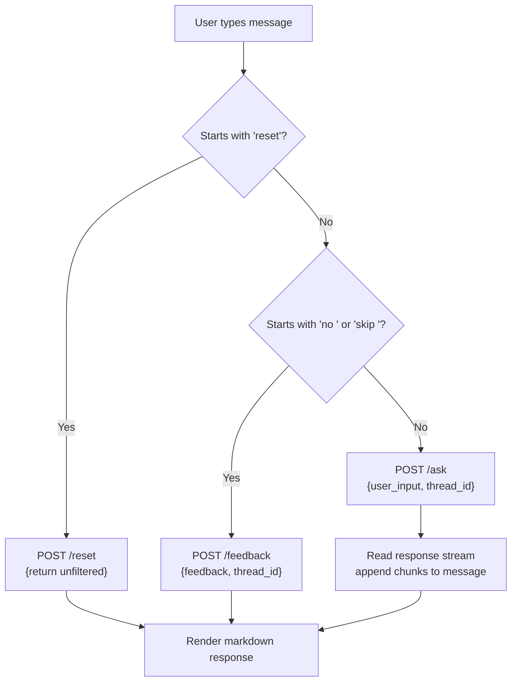

# Frontend Chat UI

The frontend is a single-page Next.js 15 application that provides a chat-like interface to the backend. It is intentionally thin — most logic lives in the backend.

## Configuration

The API base URL is set via `NEXT_PUBLIC_API_BASE` (no trailing slash), defaulting to `http://localhost:8000`:

```typescript
const API_BASE = process.env.NEXT_PUBLIC_API_BASE || 'http://localhost:8000';
```

Vercel deployment requires `NEXT_PUBLIC_API_BASE` pointing at the Render URL. The client appends paths like `/ask` to this base.

## Thread identity

Each browser session gets a stable `thread_id` stored in `localStorage`:

```typescript
function getThreadId() {
    if (!threadIdRef.current) {
        let id = localStorage.getItem('thread_id');
        if (!id) {
            id = crypto.randomUUID();
            localStorage.setItem('thread_id', id);
        }
        threadIdRef.current = id;
    }
    return threadIdRef.current;
}
```

The `thread_id` is sent with every request. It is the key for the backend's Postgres-backed memory — if it changes, the user's accumulated filters are lost.

## Message routing

The `sendMessage` function routes user input by content:



*Client-side routing: the first word determines the endpoint. Only /ask and /upload use the streaming reader.*

Commands are matched case-insensitively (`command.startsWith('reset')`, `command.startsWith('no ')`). This is a simple prefix rule — wording matters for the user.

## Streaming response reader

For `/ask` and `/upload`, the frontend reads the response body as a stream:

```typescript
const reader = res.body?.getReader();
const decoder = new TextDecoder();
setMessages(prev => [...prev, { role: 'assistant', content: '' }]);

while (true) {
    const { done, value } = await reader!.read();
    if (done) break;
    const chunk = decoder.decode(value, { stream: true });
    setMessages(prev => {
        const updated = [...prev];
        updated[updated.length - 1].content += chunk;
        return updated;
    });
}
```

Each chunk is appended to the last assistant message, progressively rendering the markdown. For `/feedback` and `/reset`, the response is read as complete text (`await res.text()`).

## CV upload

```typescript
async function handleFileUpload(e: React.ChangeEvent<HTMLInputElement>) {
    const file = e.target.files?.[0];
    if (!file) return;
    const formData = new FormData();
    formData.append('file', file);
    formData.append('thread_id', getThreadId());
    ...
    const res = await fetch(`${API_BASE}/upload`, { method: 'POST', body: formData });
    // same streaming reader as /ask
}
```

The file input is hidden and triggered by a button. Accepts `.pdf` only. The response uses the same streaming reader as `/ask`.

## Markdown rendering

Responses are rendered with `ReactMarkdown` and `remark-gfm`:

```typescript
<ReactMarkdown
    remarkPlugins={[remarkGfm]}
    components={{
        ul: ({ ...props }) => <ul className="list-disc pl-4 space-y-1 my-2" {...props} />,
        a: ({ ...props }) => <a target="_blank" rel="noopener noreferrer" {...props} />,
        code: ({ ...props }) => <code className="bg-black/20 px-1.5 py-0.5 rounded" {...props} />,
        strong: ({ ...props }) => <strong className="font-bold" {...props} />,
    }}
>
    {m.content}
</ReactMarkdown>
```

Custom components style links, code blocks, bold text, and lists to match the chat aesthetic.

## Theme toggle

Dark/light mode is toggled by adding/removing the `light` class on `<html>`. CSS variables in `globals.css` adjust colors accordingly. Commit `3e6851d` fixed invisible agent replies in light mode.

## Loading-state UI

Two loading indicators are shown depending on context:
- **`TypingIndicator`** — three animated dots, shown when the last message is not an assistant message (i.e., the user just sent a message and is waiting for a response to appear)
- **`SkeletonLoader`** — placeholder bars, shown when the last message is an assistant message but its content is still empty (i.e., the streaming response hasn't started arriving yet)

## Layout and analytics

`layout.tsx` wraps the app with Geist fonts and Vercel Analytics (commit `36aa5a8`). The metadata title is "Job Search Agent - AI-Powered Job Finder".

## Dependencies

- `next` ^15.5.19
- `react` 19.2.4
- `react-markdown` ^10.1.0
- `remark-gfm` ^4.0.1
- `@vercel/analytics` ^2.0.1
- `tailwindcss` ^4
- `@tailwindcss/typography` ^0.5.19

## Source references

- `frontend/app/page.tsx` — the entire file (343 lines)
- `frontend/app/layout.tsx` — root layout and analytics
- `frontend/app/globals.css` — theme variables
- `frontend/package.json` — dependencies
- Commits `8206fb2` (react-markdown dep), `3e6851d` (light mode fix), `36aa5a8` (analytics)
