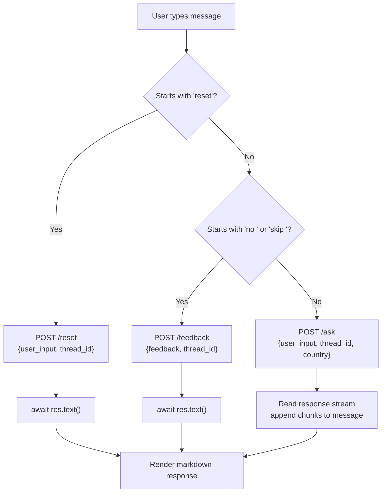

# Frontend Chat UI

The frontend is a single-page Next.js 15 application that provides a chat-like interface to the backend. It is intentionally thin — most logic lives in the backend, described in [Backend API](../architecture/backend-api.md) and the overall [Architecture Overview](../architecture/overview.md).

> **`frontend/AGENTS.md` warns: "This is NOT the Next.js you know."** This vendored Next.js build has breaking changes versus standard Next.js conventions. Read the relevant guide in `node_modules/next/dist/docs/` before writing any frontend code; heed deprecation notices.

## Configuration

The API base URL is set via `NEXT_PUBLIC_API_BASE` (no trailing slash), defaulting to `http://localhost:8000`:

```typescript
const API_BASE = process.env.NEXT_PUBLIC_API_BASE || 'http://localhost:8000';
```

Vercel deployment requires `NEXT_PUBLIC_API_BASE` pointing at the Render URL. The client appends paths like `/ask`, `/feedback`, `/reset`, and `/upload` to this base.

## Thread identity

Each browser session gets a stable `thread_id` stored in `localStorage`:

```typescript
function getThreadId() {
    if (!threadIdRef.current) {
        let id = localStorage.getItem('thread_id');
        if (!id) {
            id = crypto.randomUUID();
            localStorage.setItem('thread_id', id);
        }
        threadIdRef.current = id;
    }
    return threadIdRef.current;
}
```

The `thread_id` is sent with every request. It is the key for the backend's Postgres-backed memory — if it changes, the user's accumulated filters are lost. It is cached in a `threadIdRef` so it is only generated/read once per component lifetime.

## Country dropdown

A country selector narrows results geographically. It is backed by the `COUNTRIES` array of `[value, label]` pairs, where `value` is a slug shared by both the Workable and Jobicy integrations:

```typescript
const COUNTRIES = [
  ['', 'Worldwide'],
  ['greece', 'Greece'],
  ['cyprus', 'Cyprus'],
  ['united-kingdom', 'United Kingdom'],
  // ... Ireland, Germany, Netherlands, Spain, Portugal, Poland,
  //     United States, Canada, Australia, India
];
```

The empty-string value maps to "Worldwide". Anything not listed still works — the agent falls back to a worldwide search and filters on the listing's own location — so the list is for the user's convenience, not a hard constraint.

The chosen country lives in `localStorage`, **outside React**, and is read through `useSyncExternalStore` so the server render sees "Worldwide" (no `localStorage` there) while the browser picks up the saved choice right after hydration without setting state in an effect:

```typescript
const countryListeners = new Set<() => void>();

function readCountry(): string {
  try { return localStorage.getItem('country') || ''; } catch { return ''; }
}
function subscribeCountry(listener: () => void) {
  countryListeners.add(listener);
  return () => { countryListeners.delete(listener); };
}
function saveCountry(value: string) {
  try { localStorage.setItem('country', value); } catch { /* private mode / blocked storage */ }
  countryListeners.forEach((listener) => listener());
}

// in the component:
const country = useSyncExternalStore(subscribeCountry, readCountry, () => '');
```

`readCountry` and `saveCountry` swallow `localStorage` failures (private mode, blocked storage) so the choice still applies for the current visit. The `<select>` is disabled while `loading` is true.

**Country is sent only with `/ask` and `/upload`**, never with `/feedback` or `/reset`.

## Message routing

The `sendMessage` function routes user input by content (the lowercased, trimmed command):


```mermaid
flowchart TD
    Input["User types message"] --> Check1{"Starts with 'reset'?"}
    Check1 -->|Yes| Reset["POST /reset\n{user_input, thread_id}"]
    Check1 -->|No| Check2{"Starts with 'no ' or 'skip '?"}
    Check2 -->|Yes| Feedback["POST /feedback\n{feedback, thread_id}"]
    Check2 -->|No| Search["POST /ask\n{user_input, thread_id, country}"]
    Reset --> ReadReset["await res.text()"]
    Feedback --> ReadFb["await res.text()"]
    Search --> Stream["Read response stream\nappend chunks to message"]
    ReadReset --> Render["Render markdown response"]
    ReadFb --> Render
    Stream --> Render
```

*Client-side routing: the first word determines the endpoint. Only /ask and /upload use the streaming reader; /reset and /feedback read the full body via `await res.text()`.*

Commands are matched case-insensitively (`command.startsWith('reset')`, `command.startsWith('no ')`). This is a simple prefix rule — wording matters for the user: a message beginning with `no ` or `skip ` is treated as feedback, not a search. The `reset` request body carries `{ user_input, thread_id }`; the `/feedback` body carries `{ feedback, thread_id }`; the `/ask` body carries `{ user_input, thread_id, country }`. On any fetch failure the UI appends a fixed error message (`❌ Something went wrong. Please try again.`).

## Streaming response reader

For `/ask` and `/upload`, the frontend reads the response body as a stream:

```typescript
const reader = res.body?.getReader();
const decoder = new TextDecoder();
setMessages(prev => [...prev, { role: 'assistant', content: '' }]);

while (true) {
    const { done, value } = await reader!.read();
    if (done) break;
    const chunk = decoder.decode(value, { stream: true });
    setMessages(prev => {
        const updated = [...prev];
        updated[updated.length - 1].content += chunk;
        return updated;
    });
}
```

Each chunk is appended to the last assistant message, progressively rendering the markdown. For `/feedback` and `/reset`, the response is read as complete text (`await res.text()`).

## CV upload

```typescript
async function handleFileUpload(e: React.ChangeEvent<HTMLInputElement>) {
    const file = e.target.files?.[0];
    if (!file) return;
    setLoading(true);
    const formData = new FormData();
    formData.append('file', file);
    formData.append('thread_id', getThreadId());
    formData.append('country', country);

    setMessages(prev => [...prev, { role: 'user', content: `📄 Uploaded: ${file.name}` }]);

    const res = await fetch(`${API_BASE}/upload`, { method: 'POST', body: formData });
    // same streaming reader as /ask
    ...
    e.target.value = ''; // reset input so the same file can be re-selected
}
```

The file input is hidden and triggered by a button; it accepts `.pdf` only (`accept=".pdf"`). The `FormData` carries `file`, `thread_id`, and `country`. The response uses the same streaming reader as `/ask`; on failure a dedicated message (`❌ Failed to upload CV. Please try again.`) is appended.

## Markdown rendering

Responses are rendered with `ReactMarkdown` and `remark-gfm`:

```typescript
<ReactMarkdown
    remarkPlugins={[remarkGfm]}
    components={{
        ul: ({ ...props }) => <ul className="list-disc pl-4 space-y-1 my-2" {...props} />,
        li: ({ ...props }) => <li className="text-sm leading-relaxed" {...props} />,
        a: ({ ...props }) => (
          <a className="text-emerald-400 font-medium underline hover:text-emerald-300 transition-colors break-all"
             target="_blank" rel="noopener noreferrer" {...props} />
        ),
        code: ({ ...props }) => <code className="bg-black/20 px-1.5 py-0.5 rounded text-xs font-mono" {...props} />,
        strong: ({ ...props }) => <strong className="font-bold text-[var(--foreground)]" {...props} />,
    }}
>
    {m.content}
</ReactMarkdown>
```

Custom components style links, code, bold text, and lists to match the chat aesthetic. Links always open in a new tab with `rel="noopener noreferrer"`. The prose container toggles `prose-invert` based on `isDark`.

## Theme toggle

Dark/light mode is controlled by an `isDark` state (defaulting to `true`). An effect sets the class on the document element directly:

```typescript
useEffect(() => {
  document.documentElement.className = isDark ? '' : 'light';
}, [isDark]);
```

When dark (`isDark === true`) the `light` class is removed; when light, it is added to `<html>`. CSS variables in `globals.css` redefine all colors under a `.light` selector — including `--background`, `--foreground`, `--card-bg`, the user/assistant bubble colors, and `--muted`. The same effect overwrites `className` entirely, so it must remain the only writer of the root element's class. See [Integrations](../integrations.md) and [Workflows](../workflows.md) for how the rest of the system consumes these themes.

## Loading-state UI

Two loading indicators are shown depending on context (both gated on `loading` being true):

- **`TypingIndicator`** — three animated dots, shown when the last message is not an assistant message (i.e., the user just sent a message and is waiting for a response to appear).
- **`SkeletonLoader`** — placeholder shimmer bars, shown when the last message is an assistant message but its content is still empty (i.e., the streaming response hasn't started arriving yet).

Once the first stream chunk lands, the empty assistant message gains content and the skeleton is replaced by the progressively rendered markdown. The animations (`shimmer`, `bounce-dot`) are defined in `globals.css`.

## Layout and analytics

`layout.tsx` wraps the app with Geist Sans and Geist Mono fonts (exposed as `--font-geist-sans` / `--font-geist-mono`) and Vercel `<Analytics />`. The metadata title is `"Job Search Agent - AI-Powered Job Finder"`. The `<html>` element carries the font variables plus `h-full antialiased`.

## Dependencies

From `frontend/package.json`:

- `next` ^15.5.19
- `react` / `react-dom` 19.2.4
- `react-markdown` ^10.1.0
- `remark-gfm` ^4.0.1
- `@vercel/analytics` ^2.0.1
- `tailwindcss` ^4 (dev), `@tailwindcss/typography` ^0.5.19
- `@tailwindcss/postcss` ^4, `typescript` ^5 (dev)

## Source references

- `frontend/app/page.tsx` — the single-page chat component (409 lines)
- `frontend/app/layout.tsx` — root layout, fonts, and analytics
- `frontend/app/globals.css` — theme variables, skeleton/typing animations
- `frontend/package.json` — dependencies
- `frontend/AGENTS.md` — Next.js build warning
