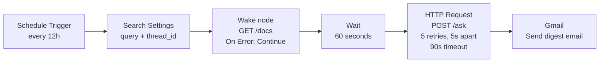

# n8n Automation

The included `n8n_workflow.json` adds automated job alerts every 12 hours. The workflow holds **no filtering logic of its own** — it only schedules, calls the API, and mails the result. Earlier versions duplicated keyword matching across JavaScript Code nodes, which meant every fix to the Python scoring had to be made twice. Now n8n delegates entirely to the backend (commit `51b9e94`).

## Node chain

*The n8n workflow: schedule → settings → wake the sleeping Render instance → wait for boot → call /ask → email the result.*

### Schedule Trigger

Fires every 12 hours.

### Search Settings

A set node carrying `query` and `thread_id`. This is the only node you edit:
- Set `query` to whatever you are looking for
- Replace `YOUR_UNIQUE_THREAD_ID` with a value only you know — `python -c "import uuid;print(uuid.uuid4())"`

### Wake node

`GET /docs` with **On Error: Continue**. On a sleeping free-tier Render instance, the first request gets an immediate `503`, not a slow response. This node exists purely to trigger the boot. Failing is its normal outcome — the workflow continues regardless.

### Wait 60 seconds

After the wake ping, the workflow waits 60 seconds for the Render instance to finish booting. Without this wait, the subsequent `/ask` request would arrive before the server is ready.

### POST /ask

HTTP Request node with:
- `retryOnFail: true`
- `maxTries: 5`
- `waitBetweenTries: 5000` (5 seconds)
- `timeout: 90000` (90 seconds)

n8n's retry ceiling (5 tries, 5s apart) covers ~25s of the ~50s cold start. The wake node + 60s wait covers the rest. The JSON body uses the `query` and `thread_id` from Search Settings.

### Gmail

Sends the `/ask` response text as a plain-text email to the configured address.

## Setup

1. Import `n8n_workflow.json` into your n8n instance
2. Configure Gmail credentials in the Gmail node
3. Set your email address in "Send a message"
4. In **Search Settings**, set `query` and replace `YOUR_UNIQUE_THREAD_ID`
5. Point both HTTP nodes at your backend (`http://host.docker.internal:8002` from Docker, `http://localhost:8002` without)

## Persistent filters

The thread outlives the workflow, so exclusions only need to be set once. Call `POST /feedback` with the same `thread_id` and something like `no senior, no staff`. Every later run reuses them. The response footer lists the filters that were actually stored — the extraction is done by an LLM and may generalize more than you intended.

## Security

Anyone who learns the `thread_id` can change that thread's filters. Do not publish it.

## When to drop the wake/wait nodes

If your backend is always on (not a sleeping free-tier instance), drop both the Wake node and the Wait node — they exist only for cold-start handling.

## Source references

- `n8n_workflow.json` — the workflow definition
- `assets/n8n_workflow.png` — workflow screenshot
- `assets/email_digest.png` — email digest screenshot
- Commits `51b9e94` (rebuild around API), `37d8aed` (auth header)
