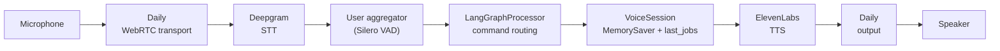
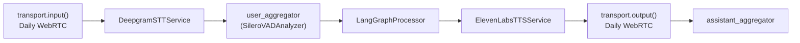
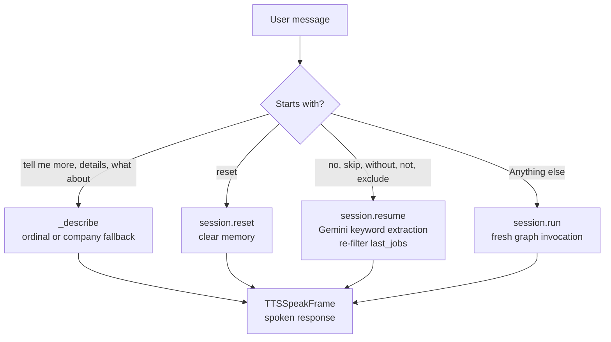

# Voice Agent

A voice interface that lets users talk to the same LangGraph job search agent powering the [REST API](architecture/backend-api.md). Built with [Pipecat](https://pipecat.ai). Runs as a local single-user demo server.

## Architecture



*The Pipecat pipeline: audio in via Daily → Deepgram STT → LangGraphProcessor routes the command → VoiceSession runs the graph → ElevenLabs TTS → audio out via Daily.*

Key design: voice sessions are **stateless and short-lived**, using an in-memory `MemorySaver` checkpointer instead of the PostgreSQL `PostgresSaver` the text agent uses. Each call gets a fresh `VoiceSession` with its own `thread_id`. The session tracks `memory` (exclusion list), `last_query`, and `last_jobs` (cached search results for local re-filtering).

## Pipeline assembly (bot.py)



*The full Pipecat cascade pipeline from bot.py: audio in → STT → user aggregator with VAD → LangGraphProcessor → TTS → audio out → assistant aggregator.*

`bot.py` assembles the pipeline using `LLMContextAggregatorPair` with a `SileroVADAnalyzer` for voice activity detection on the user aggregator. The Daily transport is configured with `audio_in_enabled=True` and `audio_out_enabled=True`. On `on_client_disconnected`, the worker is cancelled (`worker.cancel()`). The entry point is `pipecat.runner.run.main()` via `WorkerRunner`.

## How feedback differs from the text agent

The text agent's `/feedback` → `/ask` flow re-filters cached results because conversations persist across days and queries may change. In a voice call the query almost never changes mid-conversation, so the voice agent:

1. **Caches the last search results** in `VoiceSession.last_jobs`
2. Extracts avoidance keywords from user feedback via a Gemini call
3. **Filters the cached results locally** — no repeated API calls, no re-running the graph

The text agent works the same way (feedback re-filters what is already cached). The difference is only in where preferences live: the text agent persists them in Postgres across days, a voice session keeps them in memory and forgets them when the call ends.

## Command routing

`langgraph_processor.py` routes spoken commands by examining the message text. All blocking calls (graph invocation, LLM extraction) run via `asyncio.to_thread` to avoid freezing the audio pipeline. A `_last_processed_message` guard deduplicates repeated frames — if the same message text arrives twice (common in Pipecat frame processing), only the first is acted on.



*Voice command routing: the first word decides the action. Detail requests use ordinal or company/role name matching. Feedback and search both produce job lists.*

### Routing constants

| Constant | Value | Purpose |
|---|---|---|
| `FEEDBACK_WORDS` | `{"no", "skip", "without", "not", "exclude"}` | First-word triggers for feedback |
| `DETAIL_PREFIXES` | `("tell me more", "more about", "details", "what about")` | Prefix triggers for listing detail |
| `ORDINALS` | `first/one/1 → 0, second/two/2 → 1, ... fifth/five/5 → 4` | Ordinal-to-index mapping for "tell me more about the first one" |

### `_describe` fallback

When the user asks "tell me more about the first one", `_describe` first checks `ORDINALS` for an ordinal word. If none is found, it falls back to matching a company or role name the user said against `shown_jobs`. If still no match: "I didn't catch which one."

### `_speakable` sentence cutting

Job descriptions arrive truncated mid-word with a trailing `...`. `_speakable` cuts back to the last finished sentence so the TTS doesn't sound like the bot lost its train of thought. If no sentence break exists early enough, it drops the dangling last word instead.

### Terminal print vs spoken summary

Full job lists with apply links are printed to the terminal (`_print_jobs`) — a URL is useless read aloud. The spoken response (`TTSSpeakFrame`) is a short summary: "{N} jobs. Top two: {position} at {company}; {position} at {company}. The full list with links is on your screen."

## Key files

| File | Responsibility |
|---|---|
| `voice_agent.py` | `VoiceSession` class — `MemorySaver` checkpointer, `last_jobs` cache, `run`/`reset`/`resume` methods |
| `voice/server/bot.py` | Pipecat pipeline wiring: Daily transport, Deepgram STT, ElevenLabs TTS, `LangGraphProcessor` |
| `voice/server/langgraph_processor.py` | `LangGraphProcessor` — bridges Pipecat frames to `VoiceSession`, routes commands |
| `voice/server/pyproject.toml` | Dependencies managed with `uv` (Pipecat, LangChain, Gemini) |
| `voice/README.md` | Setup instructions and known limitations |

`voice_agent.py` sits at the repo root and imports `graph` directly from `agent.py` — no duplication. `langgraph_processor.py` adds the repo root to `sys.path` to reach it.

## Running

```bash
cd voice/server
uv sync
cp .env.example .env   # add API keys
uv run bot.py
```

Starts a local server at `http://localhost:7860` with the Pipecat Playground UI.

### Required environment variables

| Variable | Purpose |
|---|---|
| `DEEPGRAM_API_KEY` | Speech-to-text |
| `ELEVENLABS_API_KEY` | Text-to-speech |
| `ELEVENLABS_VOICE_ID` | Must be a Premade voice (Library/Community voices require a paid plan) |
| `GOOGLE_API_KEY` | Same Gemini key used by the main agent |
| `DAILY_API_KEY` | WebRTC transport |

> **Windows note:** `daily-python` has no native Windows build. Run the voice server from WSL2 (Ubuntu), not native Windows. Everything else in this repo runs fine on Windows.

> **Performance note:** Loading LangChain through `/mnt/c` costs ~2 minutes on first import. From ext4 (the Linux filesystem) the same call takes ~1 second.

## Known limitations

- Local, single-user demo — not deployed
- No conversation memory across calls (by design — each call is a fresh session)
- Filtering is keyword-based, not semantic — "no backend roles" won't catch "Server Engineer" unless word overlap exists
- No listing in the frozen eval set carries "senior" in its description only, so the title-only rule's distinction is not tested in the voice path either

## Source references

- `voice_agent.py` — the entire file (51 lines)
- `voice/server/bot.py` — Pipecat pipeline (137 lines)
- `voice/server/langgraph_processor.py` — command routing (135 lines)
- `voice/README.md` — setup and limitations
- Commit `64f458d` (voice interface), `2834675` (rewire for interrupt-free graph)
