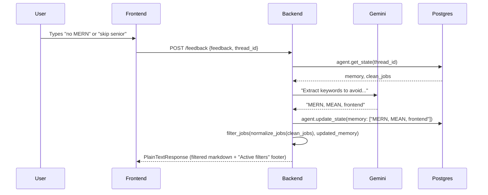

# Workflows

## 1. Keyword job search

<!-- openwiki: mermaid parse failed and this diagram was converted to a text fence so it does not break rendering. Fix the diagram source and restore the mermaid fence. Parser error: Heuristic: an unescaped angle bracket inside a label breaks rendering; rephrase the label. -->
```text
sequenceDiagram
    participant U as User
    participant F as Frontend
    participant B as Backend
    participant G as Agent Graph
    participant PG as Postgres

    U->>F: Types keyword query
    F->>B: POST /ask {user_input, thread_id}
    B->>PG: agent.get_state(thread_id)
    PG-->>B: last_fetch_time, memory, clean_jobs
    alt Cache miss (no fetch, query changed, or > 4h)
        B->>G: agent.invoke({user_input})
        G->>G: fan_out to 4 APIs
        G->>G: collect_results (dedup, score, rank)
        G-->>B: clean_jobs, last_fetch_time
    else Cache hit
        B->>B: use cached clean_jobs
    end
    B->>B: normalize_jobs(clean_jobs)
    B->>B: filter_jobs(normalized, memory)
    B-->>F: PlainTextResponse (markdown)
    F->>U: Render markdown progressively
```

*Keyword search: the three-condition cache decides whether the graph re-runs. Memory is applied post-graph.*

The search path makes **no LLM call**. Ranking is pure keyword scoring in `agent.py`. The `/ask` cache re-runs the graph only if: (1) no previous fetch, (2) the query changed, or (3) more than 4 hours have passed.

→ See [Backend API](architecture/backend-api.md) for endpoint details, [Agent graph](architecture/agent-graph.md) for scoring.

## 2. Feedback / memory update



*Feedback: Gemini extracts avoidance keywords, they are appended to thread memory, and the cached jobs are re-filtered. The graph is not re-run.*

Input is capped at 100 characters. The graph is never re-invoked — feedback is a state update plus a local re-filter.

Voice works similarly but caches `last_jobs` in-memory and never touches Postgres. MCP takes exclusions as an explicit argument per call.

→ See [Backend API](architecture/backend-api.md) for details on the /feedback endpoint.

## 3. CV upload search

1. User uploads a PDF from the frontend
2. `/upload` validates: PDF only, max 5MB
3. `pdfplumber` extracts text from the first 5 pages
4. Gemini compresses the CV into a one-sentence keyword summary (max 20 words)
5. That summary becomes the search query — the agent searches normally
6. Results are filtered by existing thread memory and returned as markdown

Both the LLM call and the graph invocation run via `asyncio.to_thread` to avoid blocking the event loop.

→ See [Backend API](architecture/backend-api.md) for details on the /upload endpoint.

## 4. n8n digest

The n8n workflow runs every 12 hours: schedule → search settings → wake node (GET /docs on sleeping Render instance) → wait 60s → POST /ask → Gmail. It holds no filtering logic — the digest gets the same deduplication, mojibake repair, and relevance ranking as every other interface.

→ See [n8n automation](operations/n8n-automation.md) for full details.

## 5. Harbor eval (CI)

Runs automatically on push/PR to `agent.py`, `mcp_server.py`, or `evals/`. The Harbor task freezes four job APIs, runs the MCP `search_remote_jobs` tool against frozen fixtures, and verifies the filtered output matches a hand-written expected set. No LLM, no network, no database.

→ See [Harbor eval](evals/harbor-eval.md) for full details.

## 6. LangSmith eval (manual)

Posts 22 queries to `/ask`, captures the response, and scores each with a Gemini judge. Score is `relevant / total`. Current baseline: 0.812. Runs against live data, so individual cases wobble — the aggregate is the signal.

→ See [LangSmith eval](evals/langsmith-eval.md) for full details.

## Change guidance

| If you change... | What to update | What to test |
|---|---|---|
| Scoring formula | `agent.py` | Harbor eval (CI) + LangSmith eval |
| `filter_jobs` logic | `agent.py` | Harbor eval (CI) |
| Source APIs | `agent.py` fetchers | LangSmith eval, update Harbor fixtures if needed |
| API contract | `main.py` → `frontend/app/page.tsx` → `n8n_workflow.json` | Manual `/ask` + `/feedback` |
| Output format | `main.py` `format_jobs_markdown` | Frontend rendering, n8n digest |
| UI routing | `frontend/app/page.tsx` | Browser test all prefix routes |
| Voice routing | `voice/server/langgraph_processor.py` | Manual voice test |
| Eval coverage | `evals/` or `eval_runner.py` | Run the eval |

## Source references

- `main.py`, `agent.py`, `mcp_server.py`, `voice_agent.py`
- `frontend/app/page.tsx`
- `eval_runner.py`, `evals/`
- `n8n_workflow.json`
